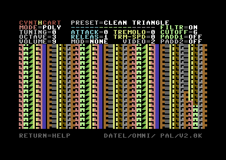
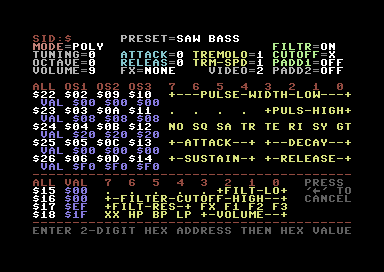

# Cynthcart

A synthesizer program for the Commodore 64 computer designed with live performance in mind. Includes arpeggiator, portamento, stereo SID and MIDI support, realtime filter control, many other features.  The program is written in 6510 assembly language.

[Cynthcart audio examples:](http://www.qotile.net/files/cynthcart_demo.mp3)

__Screenshots:__

 

## Running The Program

Cartridges are available from [Shareware Plus on Ebay](https://www.ebay.com/usr/tim685?_trksid=p2047675.l2559) and the ROM (cynthcart.prg) can be played on emulators like VICE or on real Commodore 64 hardware using an SD2IEC or similar.

## Instruction Manual

The manual is available [here](manual/cynthcart2.0.1.pdf), and there are also supplementary [keyboard reference charts](manual/keyboardReferenceCharts). 

## Building From Source

I use the [DASM assembler](http://dasm-dillon.sourceforge.net/) (old DOS/Win version included) to build the game, and the project also uses [Pucrunch](https://github.com/mist64/pucrunch) to compresses the cartridge ROM image to fit into 8K.  The [makeCynthcart.bat](makeCynthcart.bat) batch file assembles the different versions and creates the compressed cartridge ROM image.

## Copyright

©2005-2018 Paul Slocum, All rights reserved.  Source, binary, and files (other than the [DASM assembler](http://dasm-dillon.sourceforge.net/) and [Pucrunch](https://github.com/mist64/pucrunch)) are provided for personal use only.  Will likely eventually switch to an MIT license
