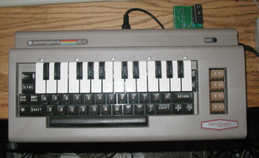

# Cynthcart

A synthesizer program for the Commodore 64 computer designed with live performance in mind. Includes arpeggiator, portamento, stereo SID and MIDI support, realtime filter control, many other features.  The program is written in 6510 assembly language.  Over 700 Cynthcart cartridges have been sold making it one of the most popular Commodore 64 homebrews.

[Cynthcart audio examples:](http://www.qotile.net/files/cynthcart_demo.mp3)

__Screenshots/Photos:__

 

__Features__
+ 30 preset sound patches
+ Arpeggiator, portamento, vibrato, and tremolo effects
+ Analog filter control and effects
+ Control of attack, release, and other sound parameters
+ MIDI support including pitch bend, patch changes, and controllers
+ On-screen help
+ Color visualizer display
+ Mono stack, 3-voice mode, and 6-voice mode (with second SID)
+ Low latency
+ SID hex editor for advanced users
+ Ability to turn off video chip to reduce noise
+ PAL and NTSC pitch tables with automatic selection
+ Copies itself to RAM (cartridge can be removed after booting)

__Supported Accessories__
+ Commodore 64 piano keyboard overlay ("Incredible Musical Keyboard")
+ Datel, Passport, Sequential, and Kerberos MIDI interface cartridges
+ Paddle controllers for realtime control of filter, pulse width, vibrato, and pitch
+ 2nd SID chip for stereo and 6-voice sound

## Running The Program

Cartridges are available from [Shareware Plus on Ebay](https://www.ebay.com/usr/tim685?_trksid=p2047675.l2559) and the ROM ([cynthcart2.0.prg](bin/version2.0.0_RELEASE/cynthcart2.0.prg)) can be played on emulators like [VICE](http://vice-emu.sourceforge.net/) or on real Commodore 64 hardware using an [SD2IEC](https://www.c64-wiki.com/wiki/SD2IEC) or similar.

## Instruction Manual

The manual is available [here](manual/cynthcart2.0.1.pdf), and there are also supplementary [keyboard reference charts](manual/keyboardReferenceCharts). 

## Building From Source

I use the [DASM assembler](http://dasm-dillon.sourceforge.net/) (old DOS/Win version included) to build the game, and the project also uses [Pucrunch](https://github.com/mist64/pucrunch) to compresses the cartridge ROM image to fit into 8K.  The [makeCynthcart.bat](makeCynthcart.bat) batch file assembles the different versions and creates the compressed cartridge ROM image.

## Copyright

©2005-2018 Paul Slocum, All rights reserved.  Source, binary, and files (other than the [DASM assembler](http://dasm-dillon.sourceforge.net/) and [Pucrunch](https://github.com/mist64/pucrunch)) are provided for personal use only.  I will likely eventually switch to an MIT license
